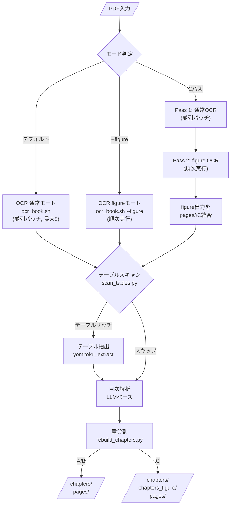

# yomitoku-ocr

**[English](README.en.md)**

[YomiToku](https://github.com/kotaro-kinoshita/yomitoku) を使った日本語書籍OCRの Claude Code スキル。

PDF → Markdown OCR → テーブル抽出 → 目次解析 → 章分割を一気通貫で自動実行します。

## 特徴

- **3モード対応**: 通常（テキストのみ）、Figure（図版抽出付き）、デュアル（2パス処理）
- **並列バッチ処理**: 大規模PDFを分割して同時OCR（最大5並列）
- **テーブル自動抽出**: テーブルリッチな文書を検出し、構造化JSONとして抽出
- **LLMベース目次解析**: 目次を解析して章ごとに自動分割
- **Apple Silicon最適化**: MPS対応（M2 Proで約12秒/ページ）

## 前提条件

- macOS Apple Silicon (M1/M2/M3/M4) または Linux NVIDIA GPU
- Python 3.10-3.13
- Claude Code CLI

```bash
brew install uv poppler
uv tool install yomitoku --python 3.13

# テーブル抽出も使う場合
uv tool install 'yomitoku[extract]' --python 3.13
```

## インストール

```bash
cd ~/.claude/skills/
git clone https://github.com/hirookagikko/yomitoku-ocr.git
```

## 使い方

インストール後、Claude Code に PDF の OCR を依頼するだけでスキルが自動発火します。

プロンプト例:
- 「この PDF を OCR して章分割までやって」
- 「図版付きで2パスOCRして」
- 「この本をテキストで検索できるようにしたい」

## パイプライン



## 構成

```
yomitoku-ocr/
├── SKILL.md              # スキルのエントリポイント
├── agents/               # パイプラインの各ステップ定義
│   ├── ocr-pipeline.md   # オーケストレーター
│   ├── ocr-book.md       # OCR実行
│   ├── ocr-toc.md        # 目次解析・章分割
│   └── ocr-extract.md    # テーブル抽出
├── scripts/              # 自動化スクリプト
│   ├── ocr_book.sh       # OCRドライバー
│   ├── rebuild_chapters.py
│   ├── scan_tables.py
│   └── ...
└── references/           # 詳細ドキュメント
    ├── API_REFERENCE.md
    ├── CLI_REFERENCE.md
    └── ...
```

## 出力

```
ocr_output/{書籍名}/
├── README.md          # 目次リンク付きメタ情報
├── chapters/          # 章ごとのMarkdown
├── pages/             # ページごとのOCR出力
├── _extractions/      # テーブル抽出結果（該当時のみ）
└── chapter_override.json
```

## サンドボックス設定

YomiToku は初回起動時に HuggingFace Hub からモデル（約630MB）をダウンロードします。

### 推奨: モデル事前キャッシュ + allowedHosts

```bash
# 1. モデルを事前ダウンロード（Claude Code 外で1回実行）
yomitoku --help

# 2. サンドボックスの allowedHosts に HuggingFace を追加
# ~/.claude/settings.local.json:
```

```json
{
  "sandbox": {
    "allowedHosts": ["huggingface.co", "*.hf.co"]
  }
}
```

### フォールバック

上記で解決しない場合のみ `dangerouslyDisableSandbox: true` を使用してください（最終手段）。`/tmp` の問題はスクリプト内の `$TMPDIR` で自動回避済みです。

## ライセンス

本スキル（スクリプト、エージェント定義、ドキュメント）は MIT ライセンスです。

ただし、本スキルが利用する [YomiToku](https://github.com/kotaro-kinoshita/yomitoku) 本体は **CC BY-NC-SA 4.0** ライセンスです。商用利用には別途ライセンスが必要です。詳細は YomiToku のリポジトリを確認してください。
