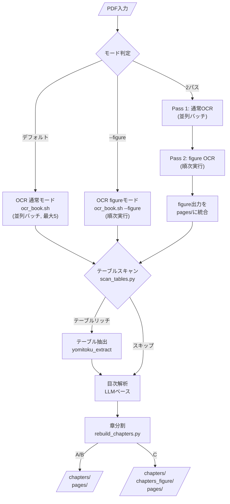

# yomitoku-ocr

**[English](README.en.md)**

[YomiToku](https://github.com/kotaro-kinoshita/yomitoku) を使った日本語書籍OCRの Claude Code スキル。

PDF → Markdown OCR → テーブル抽出 → 目次解析 → 章分割を一気通貫で自動実行します。

## 特徴

- **4モード対応**: 通常 / Figure(図版抽出) / デュアル(2パス処理) / 辞書(`--ignore_ruby` + 残ルビ調整)
- **並列バッチ処理**: 大規模PDFを分割して同時OCR(最大5並列)。`load_pdf` 遅延レンダリング化以降は1プロセス全通しも現実的
- **テーブル自動抽出**: テーブルリッチな文書を検出し、構造化JSONとして抽出
- **LLMベース目次解析**: 目次を解析して章ごとに自動分割
- **YomiToku v0.13.0 ベース**: 検出/手書き認識モデルの強化、`--ignore_ruby`、`--dpi`、`--pages` 等のネイティブ機能に対応

## 前提条件

- macOS Apple Silicon (M1/M2/M3/M4) または Linux NVIDIA GPU
- Python 3.10-3.13、PyTorch 2.6+
- YomiToku **v0.13.0** 以降
- macOS 14.0 以降 (MPS 使用時)。macOS 26 (Tahoe) は PyTorch 2.12 時点で MPS が `available=False` になるため CPU 推論 (`--lite -d cpu`) にフォールバックする
- Claude Code CLI

```bash
brew install uv poppler

# SOCKS プロキシ環境 (Cloudflare WARP, Mullvad 等) では httpx[socks] が必須
uv tool install 'yomitoku[extract]' --with 'httpx[socks]' --python 3.13

# 既に古い yomitoku が入っている場合
uv tool install 'yomitoku[extract]' --with 'httpx[socks]' --reinstall --python 3.13
# あるいは
uv tool upgrade yomitoku
```

初回はモデル ~ 630MB をダウンロードするため、サンドボックス外で 1 回プリフェッチしておくと安心です:

```bash
download_model
```

## インストール

```bash
cd ~/.claude/skills/
git clone https://github.com/hirookagikko/yomitoku-ocr.git
```

## 使い方

インストール後、Claude Code に PDF の OCR を依頼するだけでスキルが自動発火します。

プロンプト例:
- 「この PDF を OCR して章分割までやって」
- 「図版付きで2パスOCRして」
- 「この辞書を OCR して、ルビは消して」(辞書モード = `--ignore_ruby` + 残ルビ調整)
- 「この本をテキストで検索できるようにしたい」

### エージェント連携（推奨）

パーミッション確認なしでパイプラインを一気通貫で実行するには、以下のエージェント定義を `~/.claude/agents/yomitoku-worker.md` に保存してください:

```markdown
---
name: yomitoku-worker
description: YomiToku OCRパイプラインを実行するエージェント。yomitoku-ocrスキルの手順に従い、PDF→OCR→テーブル抽出→章分割を自動連結する。
tools: Read, Write, Bash, Glob, Grep, Skill, Edit
permissionMode: bypassPermissions
memory: user
---

yomitoku-ocr スキルを読み込み、パイプラインを実行するエージェント。

## 実行手順

1. スキルの SKILL.md を Read する
2. agents/ocr-pipeline.md を Read する
3. パイプラインの手順に従って実行する

スキルのドキュメントが権威ある情報源。このエージェントは実行権限を提供するだけ。
```

プロンプトで `yomitoku-worker` と書けばエージェントとして起動します。

## パイプライン


```mermaid
flowchart TD
    PDF[/"PDF入力"/]
    MODE{"モード判定"}
    OCR_A["OCR 通常モード<br/>ocr_book.sh<br/>(並列バッチ, 最大5)"]
    OCR_B["OCR figureモード<br/>ocr_book.sh --figure<br/>(順次実行)"]
    OCR_C1["Pass 1: 通常OCR<br/>(並列バッチ)"]
    OCR_C2["Pass 2: figure OCR<br/>(順次実行)"]
    MERGE["figure出力を<br/>pages/に統合"]
    SCAN{"テーブルスキャン<br/>scan_tables.py"}
    EXTRACT["テーブル抽出<br/>yomitoku_extract"]
    TOC["目次解析<br/>LLMベース"]
    SPLIT["章分割<br/>rebuild_chapters.py"]
    OUT_A[/"chapters/<br/>pages/"/]
    OUT_C[/"chapters/<br/>chapters_figure/<br/>pages/"/]

    PDF --> MODE
    MODE -->|"デフォルト"| OCR_A
    MODE -->|"--figure"| OCR_B
    MODE -->|"2パス"| OCR_C1

    OCR_A --> SCAN
    OCR_B --> SCAN
    OCR_C1 --> OCR_C2 --> MERGE --> SCAN

    SCAN -->|"テーブルリッチ"| EXTRACT --> TOC
    SCAN -->|"スキップ"| TOC

    TOC --> SPLIT
    SPLIT -->|"A/B"| OUT_A
    SPLIT -->|"C"| OUT_C
```

## 構成

```
yomitoku-ocr/
├── SKILL.md              # スキルのエントリポイント
├── agents/               # パイプラインの各ステップ定義
│   ├── ocr-pipeline.md   # オーケストレーター
│   ├── ocr-book.md       # OCR実行
│   ├── ocr-toc.md        # 目次解析・章分割
│   └── ocr-extract.md    # テーブル抽出
├── scripts/              # 自動化スクリプト
│   ├── ocr_book.sh       # OCRドライバー
│   ├── rebuild_chapters.py
│   ├── scan_tables.py
│   └── ...
└── references/           # 詳細ドキュメント
    ├── API_REFERENCE.md
    ├── CLI_REFERENCE.md
    └── ...
```

## 出力

```
ocr_output/{書籍名}/
├── README.md          # 目次リンク付きメタ情報
├── chapters/          # 章ごとのMarkdown
├── pages/             # ページごとのOCR出力
├── _extractions/      # テーブル抽出結果（該当時のみ）
└── chapter_override.json
```

## サンドボックス設定

YomiToku は初回起動時に HuggingFace Hub からモデル（約630MB）をダウンロードします。

### 推奨: モデル事前キャッシュ + allowedHosts

```bash
# 1. モデルを事前ダウンロード (v0.12.0+ では download_model コマンドが推奨)
download_model

# 2. サンドボックスの allowedHosts に HuggingFace を追加
# ~/.claude/settings.local.json:
```

```json
{
  "sandbox": {
    "allowedHosts": ["huggingface.co", "*.hf.co"]
  }
}
```

### フォールバック

上記で解決しない場合のみ `dangerouslyDisableSandbox: true` を使用してください（最終手段）。`/tmp` の問題はスクリプト内の `$TMPDIR` で自動回避済みです。

## ライセンス

本スキル（スクリプト、エージェント定義、ドキュメント）は MIT ライセンスです。

ただし、本スキルが利用する [YomiToku](https://github.com/kotaro-kinoshita/yomitoku) 本体は **CC BY-NC-SA 4.0** ライセンスです。商用利用には別途ライセンスが必要です。詳細は YomiToku のリポジトリを確認してください。
